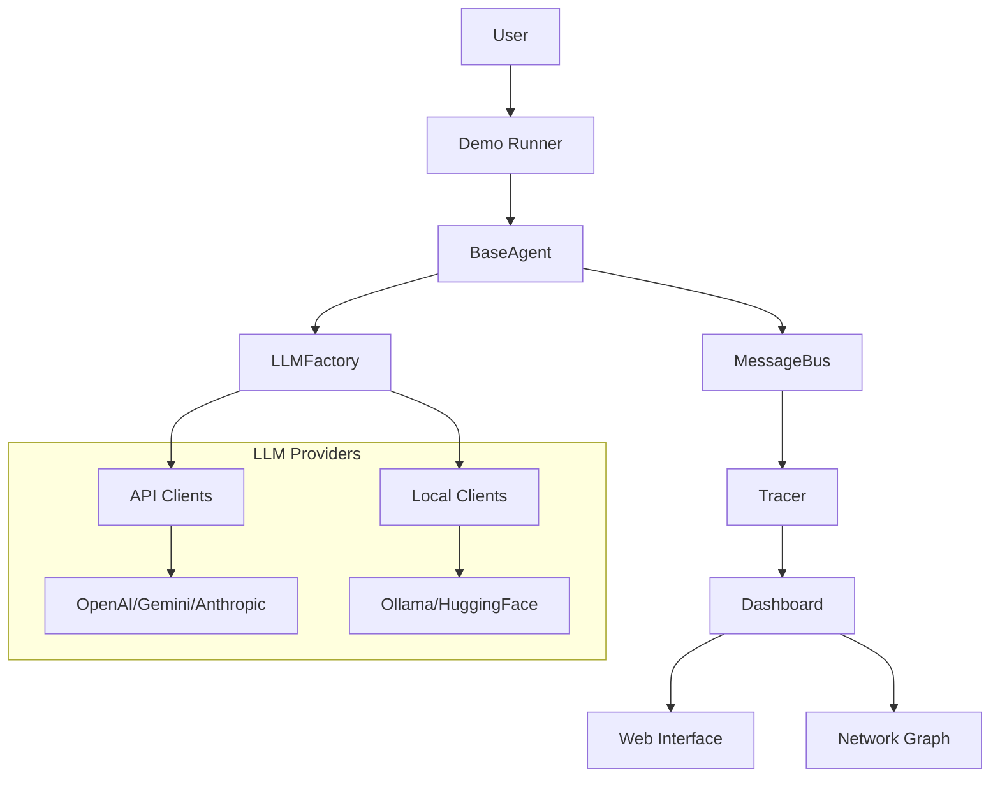

# 🏗️ MultiProdigy Architecture

Modular, schema-driven multi-agent framework with integrated LLM support and real-time observability.


## 🧱 Core Components

### **Agent Layer**
```
BaseAgent (Abstract)
├── Specialized Agents (Research, Echo, etc.)
└── Custom Agents (User-defined)
```

### **Communication Layer**
```
MessageBus
├── Agent Registration & Routing
├── Automatic Tracing
└── Error Handling
```

### **LLM Integration Layer**
```
LLMFactory
├── API Clients (OpenAI, Gemini, Anthropic)
├── Local Clients (Ollama, HuggingFace)
└── Mock Client (Testing)
```

### **Observability Layer**
```
ObservabilityDashboard
├── Real-time Metrics & Timeline
├── Network Visualization
└── Performance Tracking
```

## 🔄 Data Flow

### **Message Flow**
1. Agent sends via `self.send(content, target)`
2. MessageBus routes to target agent
3. Tracer logs interaction automatically
4. Target processes via `on_message(message)`
5. Dashboard displays real-time updates

### **LLM Integration Flow**
1. Agent creates LLM client via `LLMFactory`
2. Client handles API calls with unified interface
3. Response returned in standardized format
4. Observability tracks LLM performance

## 🎯 Design Principles

### **Modularity**
- Single responsibility per component
- Easy extension with new agents/providers
- Plugin-based architecture

### **Type Safety**
- Pydantic models for all configurations
- Schema validation throughout system
- Clear interfaces and contracts

### **Observability First**
- All interactions automatically traced
- Zero-configuration monitoring
- Real-time performance insights

### **LLM Agnostic**
- Unified interface for all AI providers
- Easy provider switching
- Consistent error handling

## 📊 Component Interactions



## 🚀 Scalability & Error Handling

### **Scalability**
- Concurrent agent execution
- Efficient message routing
- Performance monitoring and bottleneck identification

### **Error Handling**
- Graceful degradation (LLM failures → mock responses)
- Configurable timeouts with proper cancellation
- Comprehensive error tracking and recovery

## 🔗 Related Documentation

- [🤖 Agent Development](guides/agent_development.md) - Building custom agents
- [🧠 LLM Integration](guides/llm_integration.md) - Working with AI providers
- [📊 Observability](guides/observability.md) - Monitoring and debugging
- [🗂️ Modules Reference](modules_reference.md) - Complete API reference

**Ready to build?** Start with the [🚀 Getting Started Guide](getting_started.md)!
