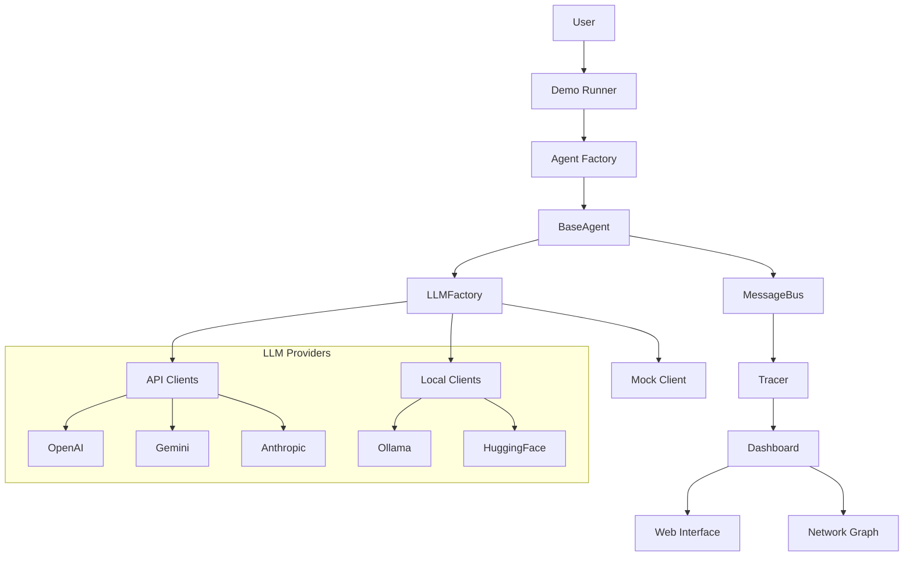

# 🏗️ MultiProdigy Architecture

## 🧱 System Overview

MultiProdigy is a modular, schema-driven multi-agent framework with integrated LLM support and real-time observability.


## 🔧 Core Components

### **Agent Layer**
```
BaseAgent (Abstract)
├── SyncLLMAgent (LLM-powered)
├── TestAllLLMAgent (Multi-provider testing)
├── SmartResearchAgent (Intelligent research)
└── Custom Agents (User-defined)
```

### **Communication Layer**
```
MessageBus
├── Agent Registration
├── Message Routing
├── Automatic Tracing
└── Error Handling
```

### **LLM Integration Layer**
```
LLMFactory
├── APILLMClient (OpenAI, Gemini, Anthropic)
├── LocalLLMClient (Ollama, HuggingFace)
├── MockClient (Testing)
└── Unified Response Format
```

### **Observability Layer**
```
ObservabilityDashboard
├── Real-time Metrics
├── Agent Timeline
├── Network Visualization
└── Performance Tracking
```

## 🔄 Data Flow

### **Message Flow**
1. **Agent** sends message via `self.send(content, target)`
2. **MessageBus** routes message to target agent
3. **Tracer** logs the interaction automatically
4. **Target Agent** processes via `on_message(message)`
5. **Dashboard** displays real-time updates

### **LLM Integration Flow**
1. **Agent** creates LLM client via `LLMFactory`
2. **Client** handles API calls with unified interface
3. **Response** returned in standardized format
4. **Agent** processes and sends response
5. **Observability** tracks LLM performance

### **Observability Flow**
1. **Tracer** captures all agent interactions
2. **Events** stored in structured JSON logs
3. **Dashboard** reads logs and builds metrics
4. **Graph Builder** creates network visualization
5. **Web Interface** displays real-time updates

## 🎯 Key Design Principles

### **Modularity**
- Each component has a single responsibility
- Easy to extend with new agents or LLM providers
- Plugin-based architecture for customization

### **Type Safety**
- Pydantic models for all configurations
- Schema validation throughout the system
- Clear interfaces and contracts

### **Observability First**
- All interactions automatically traced
- Zero-configuration monitoring
- Real-time performance insights

### **LLM Agnostic**
- Unified interface for all AI providers
- Easy switching between providers
- Consistent error handling and fallbacks

## 📊 Component Interactions



## 🚀 Scalability Features

### **Horizontal Scaling**
- Multiple agents can run concurrently
- Message bus handles routing efficiently
- Observability scales with agent count

### **Provider Flexibility**
- Easy to add new LLM providers
- Automatic fallback mechanisms
- Load balancing across providers

### **Performance Monitoring**
- Real-time metrics collection
- Performance bottleneck identification
- Resource usage tracking

## 🔒 Error Handling Strategy

### **Graceful Degradation**
- LLM failures fall back to mock responses
- Agent errors don't crash the system
- Comprehensive error logging and recovery

### **Timeout Management**
- Configurable timeouts for all operations
- Async operations with proper cancellation
- Resource cleanup on failures

### **Monitoring Integration**
- All errors automatically tracked
- Real-time error rate monitoring
- Detailed error context and stack traces
